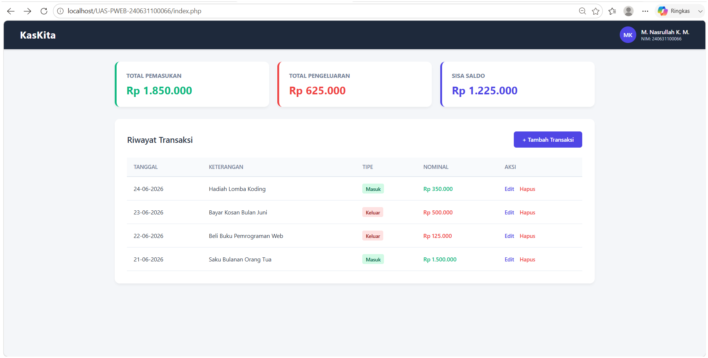
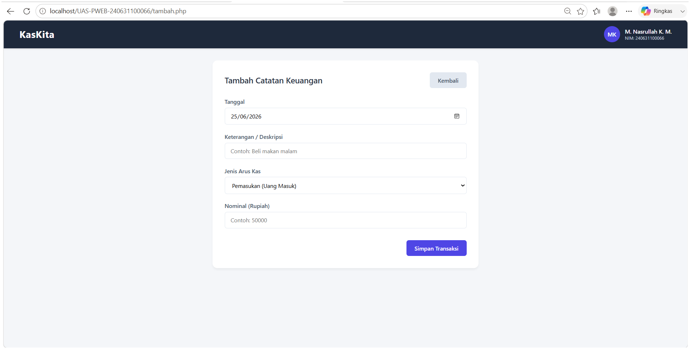
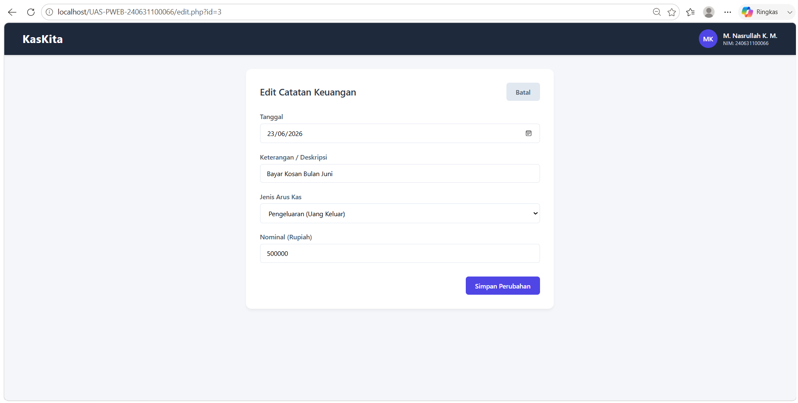

# KasKita - Sistem Catatan Keuangan Sederhana

Aplikasi web sederhana untuk melakukan pencatatan arus kas (pemasukan dan pengeluaran) secara ringkas, efisien, dan responsif. Proyek ini dibangun untuk memenuhi kriteria tugas Ujian Akhir Semester (UAS) mata kuliah Pemrograman Web.

---

## 👥 Informasi Mahasiswa
* **Nama:** M. NASRULLAH KAMAL MUSTHOFA
* **NIM:** 240631100066
* **Judul Aplikasi:** KasKita - Catatan Keuangan Sederhana
* **Format Repositori:** UAS-PWEB-2526G-240631100066

---

## 📝 Deskripsi Singkat
KasKita adalah aplikasi pengelolaan keuangan berbasis web native menggunakan kombinasi HTML5, CSS eksternal, PHP Native, dan MySQL. Aplikasi ini berfokus pada visualisasi pencatatan data transaksi harian berupa uang masuk (pemasukan) dan uang keluar (pengeluaran). Sistem secara otomatis menghitung akumulasi total pemasukan, total pengeluaran, serta kalkulasi sisa saldo akhir yang ditampilkan secara dinamis di halaman beranda.

---

## 🛠️ Spesifikasi & Implementasi Fitur
Aplikasi ini dirancang untuk memenuhi spesifikasi teknis minimal dari instruksi UAS:
1. **HTML5:** Menggunakan struktur semantik yang benar dan terbagi menjadi modul tampilan utama (Beranda/Daftar Data, Tambah Data, Edit Data, dan Hapus Data).
2. **CSS Eksternal:** Layout bersih, minimalis, responsif ramah seluler, dan diorganisasi di dalam berkas folder `css/style.css`.
3. **PHP Native:** * Menggunakan variabel, percabangan (`if-else`), dan perulangan (`while loop`).
   * Menyertakan struktur komponen lewat fungsi `include` berkas `koneksi.php`.
   * Pengolahan form data via metode `POST` dan `GET`.
   * Memiliki minimal 2 fungsi internal (`formatRupiah()` dan `amankanInput()`).
4. **MySQL (CRUD):** Integrasi operasi basis data penuh (Create, Read, Update, Delete) ke tabel relasional.

---

## 🗄️ Struktur Database
* **Nama Database:** `db_kaskita`
* **Nama Tabel:** `keuangan`
* **Spesifikasi Kolom Tabel:**
  * `id` : `INT` (Primary Key, Auto Increment)
  * `tanggal` : `DATE` (Not Null)
  * `keterangan` : `VARCHAR(255)` (Not Null)
  * `tipe` : `ENUM('masuk', 'keluar')` (Not Null)
  * `nominal` : `DECIMAL(10,2)` (Not Null)

*Aplikasi ini memuat file `database.sql` yang berisi skema tabel di atas beserta **5 record data awal** sebagai syarat penilaian instan.*

---

## 📸 Screenshot Aplikasi
Berikut adalah dokumentasi antarmuka dari sistem KasKita:

### 1. Halaman Beranda (Daftar Riwayat Transaksi & Kartu Saldo)

### 2. Halaman Tambah Catatan Keuangan Baru

### 3. Halaman Edit / Pembaruan Data

---

## 🚀 Cara Menjalankan Aplikasi secara Lokal
1. Pastikan lingkungan server lokal seperti **XAMPP** sudah terpasang di komputer Anda.
2. Unduh atau klon repositori ini, lalu tempatkan foldernya ke dalam direktori root server: 
   `C:\xampp\htdocs\UAS-PWEB-240631100066`.
3. Jalankan aplikasi panel kontrol XAMPP, kemudian aktifkan modul **Apache** dan **MySQL**.
4. Buka peramban (browser) Anda, akses menu `http://localhost/phpmyadmin/`.
5. Buat database baru dengan nama `db_kaskita`.
6. Pilih database tersebut, masuk ke tab **Import**, pilih file `database.sql` yang berada di dalam folder proyek Anda, lalu klik tombol **Go/Import**.
7. Jalankan sistem aplikasi lewat tautan browser berikut:
   👉 `http://localhost/UAS-PWEB-240631100066/`

---

## 🤖 Pernyataan Penggunaan Generative AI (GenAI)
Sesuai dengan regulasi kejujuran akademik yang ditentukan pada lembar instruksi UAS, proyek aplikasi **KasKita** ini dikembangkan dengan memanfaatkan bantuan asisten kecerdasan artifisial (GenAI). Pemanfaatan perangkat pintar tersebut diterapkan pada bagian:
* Perancangan skema tata letak arsitektur CSS eksternal agar antarmuka responsif dan estetis.
* Optimasi sanitasi fungsi PHP untuk pencegahan celah keamanan SQL Injection dasar.
* Penyusunan format dokumentasi teks markdown ini.

Pernyataan penggunaan teknologi kecerdasan buatan ini juga dijabarkan dan diulas secara transparan dalam video presentasi proyek pada tautan YouTube yang dikumpulkan.
